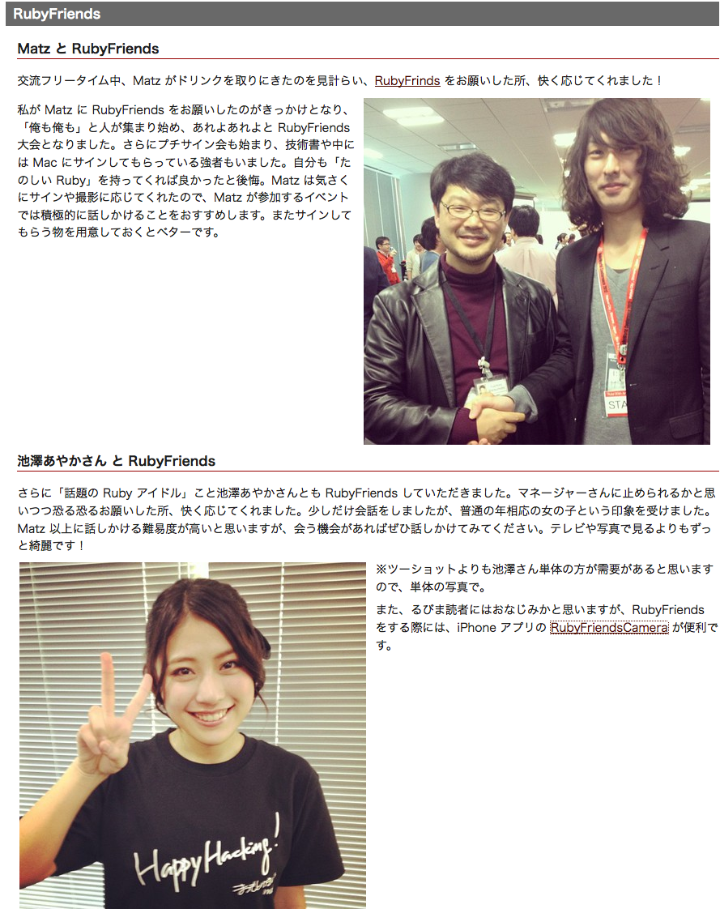
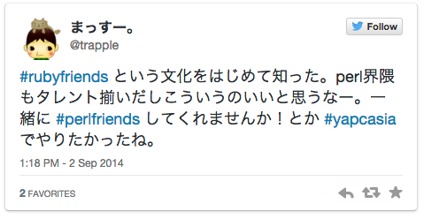
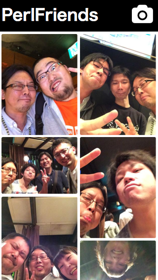
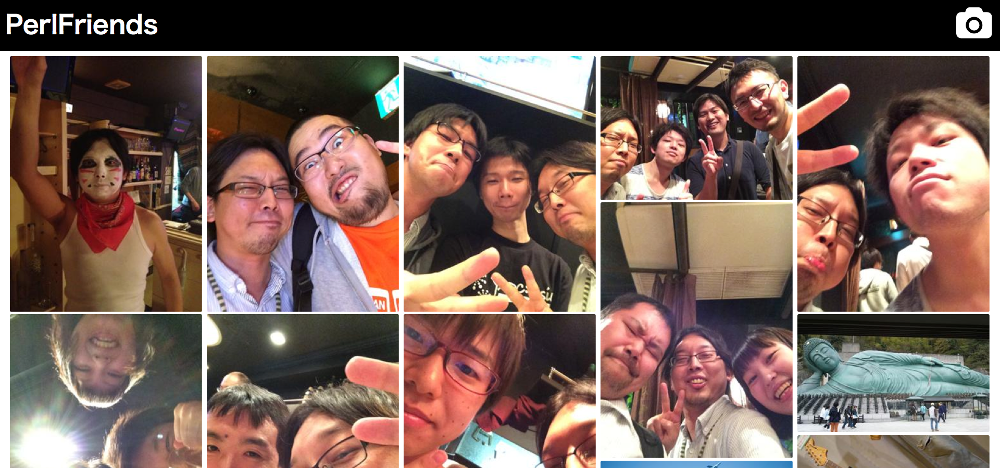

# PerlFriends

## ご提供のお知らせ

2014/09/17 Gotanda.pm #2

---
<!-- .slide: data-background="member_masuda_gray.png" data-background-repeat="repeat" data-background-size="300px" -->
# 自己紹介

## 増田博志（まっすー。）
## @trapple

- フリーランス(８年目)
- 中小規模ウェブサイト受託
- フロント寄り(最近はJavascriptメイン)
- サーバサイド(片手間)
- デザイン以外全般
- YAPC::Asiaスタッフ２年

---
<!-- .slide: data-background="hackers.jpg" data-background-repeat="repeat" data-background-size="300px" -->

## YAPCといえば、年に一度のお祭ということで
## 憧れのPerlハッカーから

---
<!-- .slide: data-background="geinin.png" data-background-repeat="repeat" data-background-size="300px" -->

## 話題のIT芸人まで
## 全国（全世界）から様々な人が集うわけですが

---

## 「あの人と話してみたいんだけど…」
## 「きっかけが…」


---

### あるスタッフのブログを読んでいたら
### Ruby界隈にはRubyFriendsというサービスがあることを知る

#### http://onigra.github.io/blog/2014/08/30/yapc-asia-2014-is-over/

---



---

# というわけで作りました!!1

---



http://perlfriends.com/

---

# 現在の機能

- 写真を撮る
- 写真をアップロードする
- 公式アカウントでTwitterに投稿する
- 写真を眺める

---

# まだこれだけです ):

---

# PerlFriendsを支える技術

---

# サーバサイドアプリ(API)

## Dancer2 ,Teng, Log::Minimal, Imager, Imager::ExifOrientation, Data::Validator, Net::Twitter::Lite, Config::Pit, Server::Starter

```
package PerlFriends;
use Dancer2;

set serializer => 'JSON';

get "/images/:page" => sub {
  my $page = param "page";

  return {
    list         => \@items
  };
}

```
---

# フロントエンド

## Knockout.js
## Masonry

---

# Knockout.js

- 双方向データバインディング
- データいじるとDOMに即反映
- AngularJSに比べると薄い
- jQueryと合わせて使いやすい
- ゆえに、混ざって危険

---

# Masonry

- いわゆるピンタレスト風グリッド
- CSS3 flexbox / columnsなどでも出来なくはない


---
# 依存ツール

- Git (.gitignore)
- Plenv (.perl-version)
- Carton (cpanfile, cpanfile.snapshot)
- Grunt (package.json)
- Bower (bower.json)
- Bundler (Gemfile, Gemfile.lock)

設定ファイル多すぎてつらい

---
# 今後

- パーマリンク
- 削除機能（実装完了！）
- 無限スクロール
- OAuthで自TLにポスト
- iPhoneアプリ
- いいね機能

---

# 僕とPerlFriendsしてください！

ご清聴ありがとうございました。

